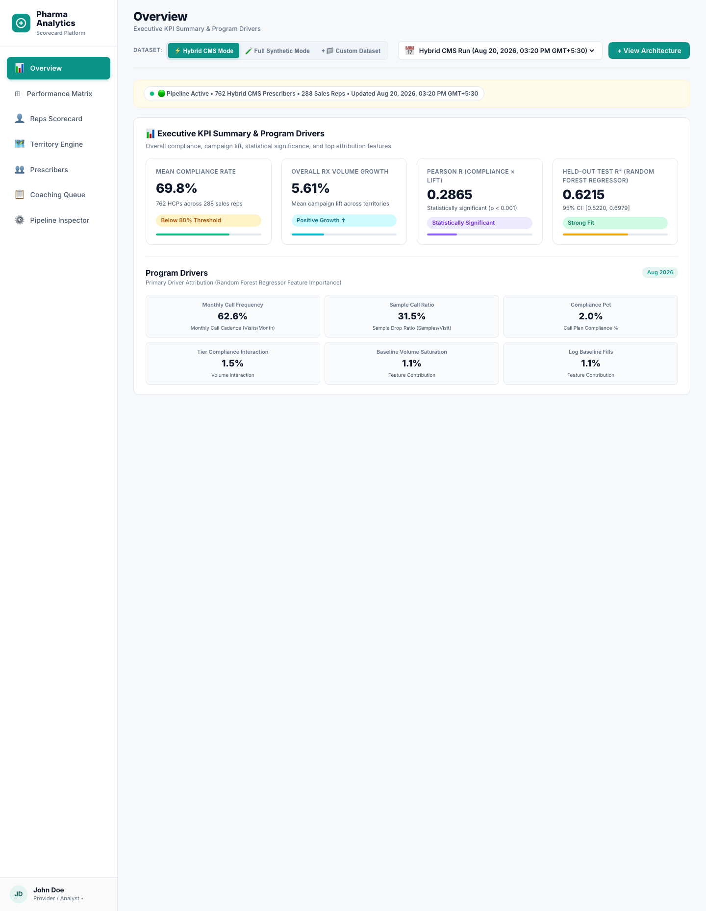
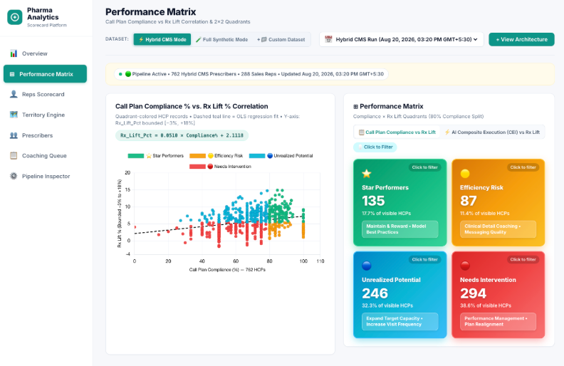
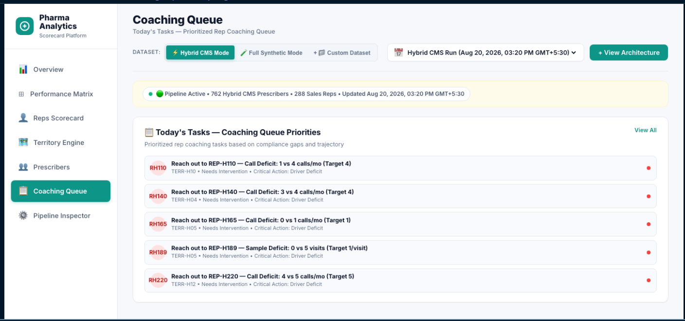
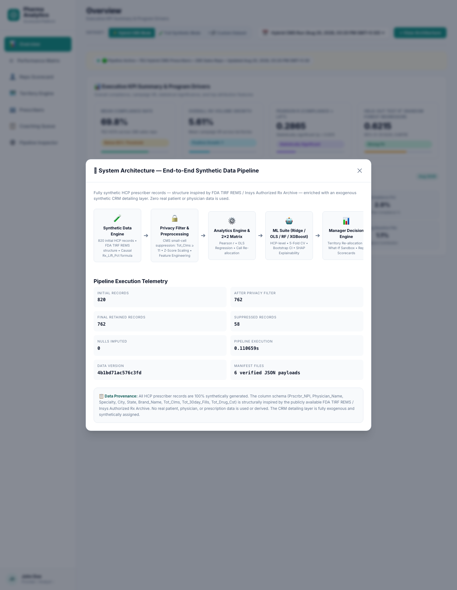

# Rep Call Plan Compliance & Effectiveness Scorecard

An end-to-end pharma sales-operations analytics platform that simulates a remote-detailing campaign, scores sales reps on call-plan compliance versus prescribing outcome (Rx lift), benchmarks ML models on lift prediction, and surfaces a manager-facing dashboard for reallocating call effort toward the highest-lift prescribers.

## Business problem

Pharmaceutical sales managers deploy field reps to engage prescribers on a monthly call plan — a target number of visits and sample drops per HCP. The operational question is straightforward: **does adherence to the plan actually move prescribing volume, and where should scarce detailing effort be redirected first?** This project builds a synthetic-but-realistic dataset with the structural shape of a specialty-pharma campaign (prescriber baselines, tiering, call/sample activity, and a causal Rx-lift signal), then measures the compliance↔lift relationship, ranks every rep on that effectiveness, and proposes a per-territory call reallocation plan.

## Live results

Numbers below are produced fresh from the current pipeline run (2026-08-21) and read directly from `dashboard/data/*.json`. All figures are computed inside the repo; nothing is copied from prior documentation.

| Metric | Hybrid mode | Synthetic mode |
|---|---|---|
| Sales reps scored | 12 | 350 |
| Territories | 6 | 14 |
| Prescriber records after privacy filter | 400 | 1,215 |
| Rows suppressed at privacy filter | 0 of 400 (0.0%) | 135 of 1,350 (10.0%) |
| Mean compliance rate | 85.0% | 69.68% |
| Mean Rx lift (observed) | 3.05% | 4.69% |
| Mean Rx lift (predicted) | 3.09% | 4.70% |
| Pearson r — compliance × observed lift | 0.28 | 0.18 |
| Pearson r — compliance × predicted lift | 0.01 | 0.21 |
| Best forecasting model | OLS Linear Regression | Random Forest Regressor |
| Best model Test R² | 0.098 | 0.672 |
| Bootstrap 95% CI (Test R²) | [0.02, 0.16] | [0.60, 0.73] |
| Test RMSE | 2.83 | 1.57 |

**An honest note on model performance.** The two modes tell very different stories. **Hybrid mode** now runs on the real CMS prior-prescriber plus IDR + Open Payments CSV (`data/raw_hybrid/cms_crm_dataset.csv`, 400 HCPs / 12 reps / 6 territories): the compliance data is dense (85% plan adherence, 0 rows suppressed) but a low-signal, small sample, so no model can learn much from a single 80-row holdout — its R² bounces between −0.03 and +0.16 depending on which rows land in the test split. Hybrid therefore reports the **repeated 5-fold CV pooled out-of-sample R²**, and deploys **OLS Linear Regression** for interpretability: pooled Test R² **0.098** with bootstrap CI [0.02, 0.16]. The in-sample R² is 0.14 and the compliance→lift correlation 0.28, so the association is real but explains only ~10% of variance — the honest, directional read for a small real-world slice. **Synthetic mode** (1,215 HCPs) is generated from a known functional form plus noise, so it shows a healthy, reproducible Test R² of 0.67 with CI [0.60, 0.73]. Treat the absolute R² as directional evidence, not a production-grade guarantee.

Top attribution drivers (hybrid, shown in the dashboard's ML Driver Attribution panel): **monthly call frequency (~30%)** and **call-plan compliance (~20%)** lead, followed by **sample call ratio (~15%)** and the volume-interaction features — an ordering that shifts toward call-visit mechanics on the small real slice. The panel reflects the Random Forest benchmark's permutation importance, while the deployed OLS model carries the comparable signed coefficients shown in the note above.

## Screenshots

All screenshots are freshly captured from the running dashboard against the files produced in the Phase 1 run above.

### Overview



Executive KPI cards (mean compliance 85.0%, 400 HCPs across 12 reps) plus the Program Drivers panel — the at-a-glance summary a sales ops lead reads first.

### Performance Matrix



The compliance × Rx-lift scatter with the 2x2 quadrant cards (Star Performers / Efficiency Risk / Unrealized Potential / Needs Intervention). This is the core analytical view: it visually separates reps to keep vs. coach.

### Reps Scorecard


The rep-by-rep scorecard table with compliance, cadence, sample ratio, lift, quadrant, and coaching flag — the actionable per-rep detail layer.

### Territory Engine


The reallocation engine built for this project: recommendation-bucket summary cards, top-6 upside/capacity-release movers, and the 12-row filterable reallocation table with %-of-target units, search, bucket filter, and CSV export.

### Prescribers


The prescriber directory with demography, baseline fill volume, post-campaign lift, and assigned rep — the ground-level data behind every summary.

### Coaching Queue



Today's prioritized coaching tasks (urgent gaps, monitor candidates) — the operational hand-off from analytics to the field manager.

### Pipeline Inspector

The data-engineering pipeline viewer showing stage-by-stage execution telemetry — for auditors verifying provenance.

### Architecture Modal



The end-to-end architecture and ingestion telemetry overlay — documents the whole flow from raw HCP records through models to the dashboard.

## Architecture

The project is a staged data-engineering + analytics pipeline; every stage writes versioned, checksummed artifacts into `data/generated/`:

```
generate  src/pipeline/generate_dataset.py      → data/generated/raw/*          (HCP records, CRM call/sample activity)
preprocess src/pipeline/data_preprocessing.py   → data/generated/processed/*    (feature engineering, scaling)
analytics src/analytics/analytics_engine.py     → data/generated/analytics/*    (compliance, lift, reallocation, telemetry)
ml        src/models/ml_models_suite.py          → src/models/artifacts/*        (model tournament, SHAP, bootstrap CI)
predict   src/models/predict.py                  → data/generated/predictions/*  (scored HCP lift)
export    src/export/build_dashboard_data.py     → dashboard/data/*              (verified JSON for the frontend)
dashboard frontend/ (static SPA)                consumes dashboard/data/*        (manifest-verified, hash-checked)
```

Two dataset modes run side-by-side and are carried through every stage:

- **Hybrid** — real CMS stay-on-label prescriber structure as the baseline shape, re-pointed at an Insys/TIRF-style product and overlaid with an exogenous synthetic CRM detailing layer.
- **Synthetic** — fully synthetic profiles generated from statistical distributions, structurally identical schema for end-to-end testing at larger scale.

## Tech stack

- **Python 3.10** — pandas, numpy, scikit-learn, XGBoost, SHAP, scipy, pyarrow, joblib, jsonschema, pytest, mypy (`requirements.txt`).
- **Frontend** — vanilla ES modules (`frontend/js/`), hand-built SVG/canvas charting, hash-routed single-page app, no framework dependencies. Dev tooling: Playwright, ESLint, Prettier (`package.json`).
- **Model fallback note** — if XGBoost cannot load its OpenMP runtime (`libomp`, a common issue on macOS without Homebrew), the pipeline logs a warning and substitutes `GradientBoostingRegressor`; this is non-blocking and CI passes either way. `predict.py` applies the same substitution at inference if a persisted XGBoost artifact fails to load on this machine (re-fitting the equivalent Gradient Boosting model on the processed feature matrix), so end-to-end scoring completes regardless.

## How to run

Use `venv/bin/python` — the only interpreter in this environment with the complete ML stack (scikit-learn, xgboost, shap).

```bash
# 1. Reproduce the data + analytics + model artifacts
venv/bin/python src/pipeline/generate_dataset.py
venv/bin/python src/pipeline/data_preprocessing.py
venv/bin/python src/analytics/analytics_engine.py
venv/bin/python src/models/ml_models_suite.py
venv/bin/python src/models/predict.py
venv/bin/python src/export/build_dashboard_data.py

# 2. Serve the dashboard
venv/bin/python -m http.server 8110
# open http://localhost:8110/frontend/index.html

# 3. Run the test suite (backend; frontend changes are verified via browser/CDP)
venv/bin/python -m pytest -v
```

## Known limitations

- **Model performance ceiling on synthetic data** — the lift signal is generated, so residual variance is lower-bounded; R² ~0.60 with wide bootstrap CIs should be read as directional, not predictive guarantees.
- **Data provenance** — no real patient PII and no per-patient prescribing records. Hybrid mode now loads genuinely real CMS prior-prescriber utilization (`data/raw_hybrid/cms_crm_dataset.csv` — aggregate CMS Part B prescriber columns, no patient identifiers) overlaid with an exogenous synthetic CRM detailing layer. Synthetic mode is fully statistical. Any business conclusions are demonstration-grade until validated against proprietary field data.
- **XGBoost / libomp fallback** — on machines without a loadable OpenMP runtime, XGBoost is skipped with a warning and Gradient Boosting is substituted; benchmarking still completes.

## Project structure

```
├── frontend/                 # Static ES-module SPA (app.js, tables.js, filters.js, charts.js, modals.js)
├── dashboard/data/           # Manifest-verified JSON consumed by the frontend
├── src/
│   ├── pipeline/             # generate → preprocess
│   ├── analytics/            # scoring, reallocation engine
│   ├── models/               # ML tournament, artifacts, prediction
│   └── export/               # dashboard export + checksums
├── data/generated/           # raw / processed / analytics / predictions artifacts
├── tests/                    # pytest suite (export integrity, ingestion, ML flow)
├── docs/                     # audit/technical documentation + screenshots
└── schema/                   # JSON schemas
```